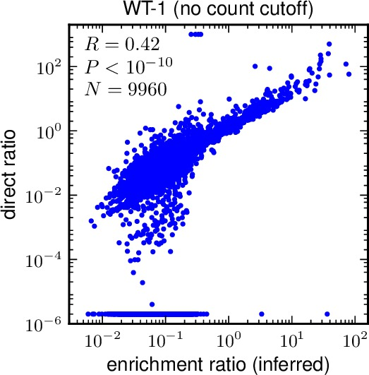
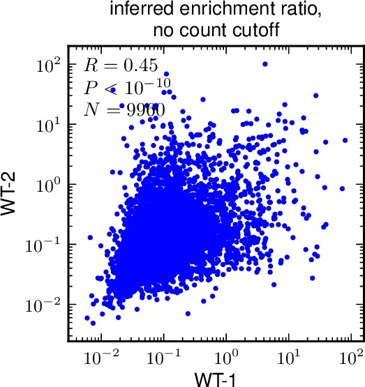

.. _mapmuts_enrichmentcorrelate.py:

=========================================
mapmuts_enrichmentcorrelate.py
=========================================
This is an analysis script for the output produced by :ref:`mapmuts_inferenrichment.py`.
This script requires `matplotlib`_ to make the plots. It will raise an error if `matplotlib`_ is not available. This script also requires `scipy`_ in order to calculate correlation coefficients. However, you can still use the script if `scipy`_ is unavailable -- you just won't get any correlation coefficients.

The script takes as input the enrichment ratios in the *enrichmentratios* file(s) produced by :ref:`mapmuts_inferenrichment.py` and generates some useful correlation plots. All plots are on logarithmic scales since the enrichment scores are themselves ratios which naturally correspond to log scales.

The *enrichmentratios* files created by :ref:`mapmuts_inferenrichment.py` contain the following data for each mutation:

    * The posterior mean enrichment ratio *phi*, along with the upper and lower limits of its 95% highest posterior density. This will always be a number > 0.

    * The *directratio*, which is the enrichment calculate directly by dividing the counts in the selected by unselected libraries after subtracting errors. This number will typically be > 0, but it can also be zero, negative, or plus or minus infinity when the counts are very low (such that the estimated errors match or exceed the counts).

    * The number of counts, *mutdnacounts* for the mutation in the input mutant library, which is roughly the denominator (before subtracting errors) for the enrichment ratio. This will be an integer >= 0. It gives some idea of how many counts went into determining *phi* and *directratio* -- larger numbers of counts will typically correspond to more robust estimates.

Typically you would use this script for one of the following goals:

    1) For a single library, you might want to compare how well *phi* the inferred enrichment ratio matches the direct *directratio* estimates. This program allows you to do this by generating a plot and calculating a Pearson correlation coefficient. You can also restrict your analysis to just include sites where *mutdnacounts* exceeds some cutoff (these are the sites with more data points).

    2) For two (or more) libraries, you might want to compare the inferred enrichment ratios *phi* and the *directratios* between pairs of libraries. This script allows you to do this by generating plots and calculating correlation coefficients.

Running the script
--------------------
To run this script, simply create an input file with the format described below. If you name your input file ``enrichmentcorrelate_infile.txt``, then run the command::

    mapmuts_enrichmentcorrelate.py enrichmentcorrelate_infile.txt

Input file
--------------
The input file is a text file with a series of *key* / *value* pairs. The required keys are indicated below. The values should not include spaces.

Lines beginning with # and empty lines are ignored.

Keys for the input file:

* *enrichmentratios* : A listing of the enrichment ratio files generated as ``*_enrichmentratios.txt`` by :ref:`mapmuts_inferenrichment.py`. You must list at least one file here, but can list more than one if you also want to look at correlations between pairs of samples. The files must exist, and the filenames cannot contain any spaces. To list multiple files, just separate them by spaces.

* *samplenames* : A listing of the sample names for each of the files specified by *enrichmentratios*. These are the names that are given to the samples in plots that compare across multiple samples. You must specify the same number of sample names here as you specify files under *enrichmentratios*, so there is one name for each corresponding sample. The sample names can NOT contain spaces, and different sample names are separated by spaces. However, if you include an underscore in the sample name then it is converted to a space in the actual plots.

* *mutdnacounts_cutoff* : One or more integers >= 0. Specifies the correlation plots should include only mutations for which *mutdnacounts* is >= the number specified here. Setting *mutdnacounts_cutoff* to zero means that all mutations will appear on the correlation plots. If you specify multiple numbers, then plots are created for each cutoff.

* *plotdir* specifies the directory where we place the plots. If you want them to be in the current directory, just make this ``./``. Otherwise specify some other directory, such as ``enrichmentcorrelations/``. Directories specified by this prefix must already exist -- nonexistent directories are NOT created, and an error will be raised if you specify a directory that does not already exist.

* *limitadjustment* specifies how we handle *directratio* values that are <= 0 or equal to *inf* (infinity). Because our plots are on a log scale, they can only handle finite ratios that are > 0. The enrichment values *phi* should satisfy this, but *directratio* will not always do so (for example if the numerator or denominator in the ratio is zero). In order to plot these values and calculate correlations, any values <= 0 are set to be equal to the minimum *directratio* that is > 0 divided by *limitadjustment*. Similarly, any value of *directratio* equal to *inf* is set to be equal to the maximum finite value of *directratio* times *limitadjustment*. For this to work, *limitadjustment* itself must be a number >= 1. If you set *limitadjustment* to one, then out of bounds values will be set to the maximum or minimum of the in-bounds values. This is somewhat sensible, but it may be preferable to set *limitadjustment* to a value such as 2 or 10 so that the out-of-bounds values are noticeably separated from those with actual plottable values of *directratio*.

Example input file
---------------------
Here is an example input file::

    # Input file for mapmuts_enrichmentcorrelate.py
    enrichmentratios WT-1/WT-1_enrichmentratios.txt WT-2/WT-2_enrichmentratios.txt N334H-1/N334H-1_enrichmentratios.txt N334H-2/N334H-2_enrichmentratios.txt
    samplenames WT-1 WT-2 N334H-1 N334H-2
    mutdnacounts_cutoff 0 100
    plotdir enrichmentcorrelations/
    limitadjustment 2

Output
--------
This script will write some brief output to standard out (*sys.stdout*) describing its progress.

**IMPORTANT NOTE:** The Pearson correlation coefficients are computed on the data as it is plotted. So these are correlations for the log-transformed data with any out-of-bounds points adjusted to in-range points as specified by *limitadjustment*.

Two types of plots are generated: plots comparing the inferred enrichment ratios *phi* with the direct estimates *directratio*, and plots comparing both *phi* and *directratio* across multiple samples (if more than one sample is specified). Both types of plots are in PDF format generated with `matplotlib`_, and they include Pearson correlation coefficients if `scipy`_ is available. Specifically:

* For each sample and each *mutdnacounts_cutoff*, a plot of *phi* versus *directratio* is made. These plots only include mutations with values of *mutdnacounts* that are >= *mutdnacounts_cutoff*. The plots are named as ``*/*_inferred_vs_direct_cutoff*.pdf`` where the first * is filled by *plotdir*, the second * by the sample name, and the third by the value of *mutdna_cutoff*. For example, for the input file above, a plot would be ``enrichmentcorrelations/WT-11_inferred_vs_direct_cutoff0.pdf``. Here is an example of such a plot:

* If multiple samples are specified by *enrichmentratios* and *samplenames*, then plots are created that correlate the inferred enrichment ratios *phi* and the direct ratios *directratio* between all pairs of plots, making a separate plot for each cutoff specified by *mutdnacounts_cutoff*. The correlation plots include only those mutations for which both samples have values specified, and for which both samples have a number of counts that satisfies *mutdnacounts_cutoff*. The plots are named as ``*/*_vs_*_inferred_cutoff*.pdf`` and ``*/*_vs_*_direct_cutoff*.pdf`` where the first * is filled by *plotdir*, the second * by the first sample in a pair, the third * by the second sample in a pair, and the last * by the value of *mutdna_cutoff*. So for the above example input file, the names would be ``enrichmentcorrelations/WT-1_vs_WT-2_inferred_cutoff0.pdf``, etc. Here is an example of such a plot:

.. include:: weblinks.txt
