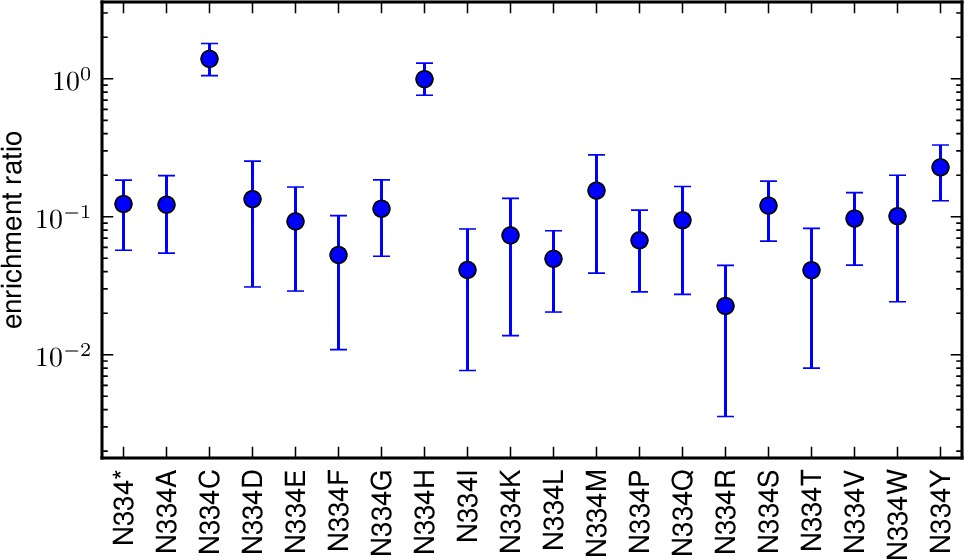
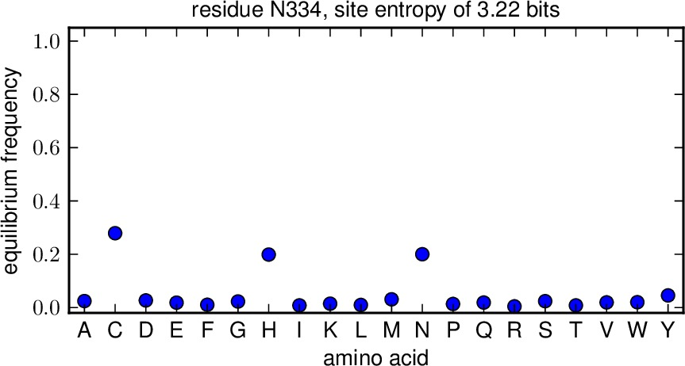

.. _mapmuts_inferenrichment.py:

======================================
mapmuts_inferenrichment.py
======================================

This script is designed to infer the enrichment or depletion of given amino-acid mutations in a selected versus unselected library, accounting for errors afflicting both. It does this using a Bayesian approach that uses MCMC (Markov chain Monte Carlo).

Because this script implement MCMC algorithms, it takes a fairly long time to run -- perhaps as long as several days depending on your computer and the specific problem.

This script uses the *codoncounts.txt* files created by :ref:`mapmuts_parsecounts.py`, and so is designed to be run after you have completed the analysis with that script.

Dependencies
--------------
This script requires `pymc`_ for the Bayesian inference, which in turn requires `numpy`_. To get the plots, you also need `matplotlib`_. The MCMC is much more efficient if `scipy`_ is available, so installation of `scipy`_ is strongly recommended.

Background and nomenclature
------------------------------
This script is designed for the analysis of plasmid mutant libraries and viruses grown from those libraries. One can imagine that most of the mutations in the plasmid mutant library will be subject to selection upon viral growth: favorable mutations may increase in frequency, and deleterious mutations may decrease in frequency. The enrichment ratio for each amino acid, which we denote by *phi*, is the expected change in frequency of that mutation after accounting for various sources of errors and limited sampling. Favorable mutations with have *phi > 1*, and unfavorable mutations will have *phi < 1*.

It is conceivably possible to calculate *phi* for codon, nucleotide, or amino-acid mutations. Here we calculate *phi* for amino-acid mutations from codon-level data. We assume that all codon mutations that lead to the same amino-acid change have the same value of *phi*, so that there is no differential selection on synonymous codons.

We consider an experiment that contains the following four samples:

    * *DNA* : this sample is simply sequencing of the wildtype DNA. It measures the sequencing error rate.

    * *RNA* : this sample is simply sequencing of reverse-transcribed RNA generated from the wildtype DNA. It measures sequencing errors and reverse-transcription errors.

    * *mutDNA* : this sample is sequencing of the plasmid mutant library. It measures the underlying mutagenesis rate in the mutant library, plus any sequencing errors.

    * *mutvirus* : this sample is sequencing of the virus mutant library. It measures the selection on the mutations in the *mutDNA* library, plus any reverse-transcription and sequencing errors.

Conceptually, if there were no sources of sequencing error, then *phi* would just be equal to the number of times a mutation occurred in the *mutvirus* library divided by the number of times that it occurred in the *mutDNA* library, although there would of course be sampling errors that would bias the estimate of *phi* for finite size libraries. This script accounts for sources of error, and estimates the posterior distribution of *phi* given the sampling errors.

This script also defines another parameter, the equilibrium frequency *pi* of each amino-acid identity at a site. This can be thought of as the probability that a site would have some identity if the relative frequencies of the wildtype and mutant amino acids where those given by the enrichment ratios for all sites, and then normalized to sum to one. So *pi* for any particular amino-acid identity can be thought as the possibility that the site has that identity.

Finally, sites are characterized by their site entropy *h*. This is the site entropy (log base 2, so units of bits) if the amino acids were found at the equilibrium frequencies *pi*.

Inference algorithm
--------------------
A full description of the inference algorithm, definition of likelihood and prior functions, etc, can be found in the following PDF file :download:`enrichment_inference_algorithm.pdf <enrichment_inference_algorithm.pdf>`

Implementation of the MCMC
----------------------------
The posterior distribution for the enrichment ratio is estimated by MCMC using the `pymc`_ package. The script is designed to enable automatic testing for convergence using the *convergence* and *nruns* options. It is suggested that you use *nruns > 1* and *stepincrease > 1* so that you can try to ensure convergence. When multiple runs of MCMC are performed, they start from approximate maximum a posteriori estimates of the various parameters (made using an empirical Bayes strategy that may not find the true maximum, but is good enough to be useful) that are determined using `scipy`_. If `scipy`_ is not available, then each run instead starts with random parameter values drawn from the prior. This takes longer to converge, which is why installation of `scipy`_ is strongly suggested. 

Running the script
--------------------
To run this script from the prompt, first create a text infile of the
format described below. Then simply type :ref:`mapmuts_inferenrichment.py`
followed by the infile name. For example, if the name is ``infile.txt``,
type::

    mapmuts_inferenrichment.py infile.txt

Input file
--------------
The input file is a text file with a series of *key* / *value* pairs. The required keys are indicated below. The values should not include spaces.

Lines beginning with # and empty lines are ignored.

Keys for the input file:

* *DNA_files* : The input data for this script are the *_codoncounts.txt* files created by :ref:`mapmuts_parsecounts.py`. For each library being used for the inference (and you can combine data from multiple libraries), this key should be followed by a string giving the path to the *_codoncounts.txt* file for the *DNA* sample. The number of files listed here must be the same as the number listed for *RNA_files*, *mutDNA_files*, and *mutvirus_files* as all four files are needed for each library -- they should also be listed in the same order (i.e. library 1, library 2, etc). Only definitively called codons (both reads agree, upper case in the *_codoncounts.txt* file) are used in the counts.

* *RNA_files* : like *DNA_files* but for the *RNA* samples.

* *mutDNA_files* : like *DNA_files* but for the *mutDNA* samples.

* *mutvirus_files* : like *DNA_files* but for the *mutvirus* samples.

* *excludesite_NNN* : This is an optional key that does not have to appear at all. You would use this key if you want to exclude a particular site from just one of multiple libraries specified by *DNA_files*, *RNA_files*, *mutDNA_files*, and *mutvirus_files*. For instance, imagine that those keys specify four files each. Imagine that the first two and last two files differ in identity at residue 334, so that only two of the libraries (say the first two) would be used for the inference at this site. You would then set::

    excludesite_334 use use exclude exclude

  In this usage, the key *excludesite_* has a suffix giving a site number. There then should be a number of entries equal to the number of files specified for *DNA_files*, etc. In order, put *use* if that file is used for that site and *exclude* if that file is excluded for that site. Note, however, that at least one file must be *use* for each site. If you don't want to exclude any sites from particular libraries, then just don't include this key. If you want to exclude more than one residue, then have multiple entries of the key.

* *alpha* : a number > 1 giving the shape parameter for the gamma distribution priors. A suggested value is 4. Larger values correspond to sharper priors, while smaller values correspond to broader priors.

* *phi_prior* : the mean of the prior distribution over *phi*. This should be your prior estimate for the enrichment ratio for a site before observing any data. Since most mutations will probably be deleterious, it is suggested to choose a value less than one, such as 0.1.

* *minbeta* : a number specifying the minimum beta value for the gamma distribution priors over the mutation and error rates (*mu*, *epsilon*, and *rho*), which are estimated from the library means. This keeps this number for being set to zero or negative for priors with very low means. A reasonable value is 1e-8.

* *seed* : integer seed for the random number generator. Runs with the same seed should generate exactly the same output. Otherwise the output may differ for different seeds as the MCMC uses random numbers.

* *nruns* : the number of independent MCMC runs. Must be at least one, but it is recommended that you use more (such as at least 2 and preferably 3) as this allows checks for MCMC convergence. When multiple runs are performed, the reported enrichment ratio comes from all three runs.

* *nsteps* : the number of steps for each MCMC run. A reasonable value is probably 10000. Larger values will give better posterior sampling but longer run times.

* *burn*  : the number of burn-in steps for each MCMC run. These burn-in steps are not counted towards the posterior as they are assumed to correspond to chain equilibration. In order to guarantee some steps that are informative, you must have *burn < nsteps*. Typically, you might want to choose *burn* to be 20% of *nsteps*.

* *thin* : the posterior is only recorded every *thin* steps. If you want to record every value, then set *thin* to one. However, consecutive steps are usually correlated, so it is often preferable to set *thin* to a number greater than one. A suggested value is 10. Both *burn* and *nsteps* must be multiples of *thin*.

* *convergence* : the test applied to the MCMC runs to see if they converged. This option is only meaningful if *nruns* > 1 (as it probably should be). The Gelman-Rubin statistic (which compares within run and between run variance) is calculated. If the MCMC is totally converged, this statistic should theoretically be one -- incomplete convergence will make it greater than one. In this script, the chain is considered to have converged if this statistic is < *convergence*. Typically, you might want to set *convergence* to a value of 1.05. If the chain has not converged, what is done next depends on the values of *stepincrease* and *convergencewarning*.

* *stepincrease* : If the chain fails to converge for a given enrichment ratio (according to the criterion of *convergence*), then the default action is to try to increase the number of steps to be equal to *stepincrease * nsteps*. We then test again for convergence for these longer MCMC runs. Typically increasing the step number might improve convergence. So *stepincrease* must be a number >= 1. If it is one, that is equivalent to not doing any *stepincrease*, and nothing is tried and we proceed to the action specified by *convergencewarning*. If *stepincrease* is greater than one, we then try running the MCMC for *stepincrease * nsteps* steps for each run. If the chain then converges (according to *convergence*) the new inferences are used and nothing further is done. If it still does not converge, we still use the inferences from these longer runs, but then also proceed to the action specified by *convergencewarning*. Typically you might want to set *stepincrease* to a value of 5 or 10.

* *convergencewarning* : If the chain still fails to converge after *stepincrease*, this switch specifies whether we print a warning. If set to *True*, we print such a warning. If set to *False*, no warning is printed.

* *MCMC_traces* is the directory to which we write plots showing the traces of the enrichment ratio *phi* as a function of the number of MCMC steps after burnin and thinning. If you set this to the string *None*, then no such plots are created. Otherwise, if `matplotlib`_ is available, then files with the prefix specified by *outfileprefix* and the suffix corresponding to the mutation (such as *M1A.pdf* or *N334H.pdf*) are created in the directory *MCMC_traces*. Note that this directory must already exist; it is NOT created.

* *enrichmentratio_plots* is the directory to which we write plots showing the enrichment ratios for all mutations at a site. Shown are the posterior mean and the 95% highest probability density of the posterior. If you set this to the string *None*, then no such plots are created. Otherwise, if `matplotlib`_ is available, then files with the prefix specified by *outfileprefix* and the suffix corresponding to the mutation (such as *M1A.pdf* or *N334H.pdf*) are created in the directory *enrichmentratio_plots*. Note that this directory must already exist; it is NOT created.

* *equilibriumfreqs_plots* is the directory to which we write plots showing the equilibrium frequencies for all amino acids at a site. If you set this to the string *None*, then no such plots are created. Otherwise, if `matplotlib`_ is available, then files with the prefix specified by *outfileprefix* and the suffix corresponding to the residue (such as *M1.pdf* or *N334.pdf*) are created in the directory *equilibriumfreqs_plots*. Note that this directory must already exist; it is NOT created.

* *outfileprefix* is a string giving the prefix for the output files described below.

Example input file
---------------------
Here is an example input file::

    # Input file for mapmuts_inferenrichment.py
    DNA_files DNA/WT-1_DNA_codoncounts.txt
    RNA_files RNA/WT-1_RNA_codoncounts.txt
    mutDNA_files mutDNA/WT-1_mutDNA_codoncounts.txt
    mutvirus_files mutvirus-p1/WT-1_mutvirus-p1_codoncounts.txt
    alpha 4.0
    phi_prior 0.1
    minbeta 1e-8
    seed 1
    nruns 3
    nsteps 10000
    burn 2000
    thin 10
    stepincrease 5
    convergence 1.05
    convergencewarning True
    MCMC_traces None
    enrichmentratio_plots enrichmentratio_plots/
    equilibriumfreqs_plots equilibriumfreqs_plots/
    outfileprefix WT-1

Output
--------
Output files are created with the prefix specified by *outfileprefix*. If any of these files already exist, they are overwritten. These files are:

* *outfileprefix*\_inferenrichment_log.txt : a text file logging the progress of this script as it proceeds.

* *outfileprefix*\_enrichmentratios.txt : a text file giving the enrichment ratios at each site as estimated by the MCMC, as well as the values that would directly be inferred by simply taking the frequencies for that mutation in each sample as follows: *(mutvirus - RNA) / (mutDNA - DNA)*. The file has the following columns (separated by tabs):

    - *MUTATION* : mutation name, such as *M1A*.

    - *PHI* : the inferred enrichment ratio as the posterior mean.

    - *PHI_HPD95_LOW* : the lower bound for the 95% highest probability density region of the posterior.

    - *PHI_HPD95_HIGH* : the lower bound for the 95% highest probability density region of the posterior.

    - *DIRECT_RATIO* : the ratio that would be directly inferred simply by taking the frequencies in each sample, as in *(mutvirus - RNA) / (mutDNA - DNA)*.

    - *MUTDNA_COUNTS* : the total number of counts for the mutation in the *mutDNA* library.

  Here is an example of a few lines::

    #MUTATION PHI PHI_HPD95_LOW PHI_HPD95_HIGH DIRECT_RATIO MUTDNA_COUNTS
    G185V   0.026264    0.006302    0.050351    0.007457    317
    G185Y   0.033638    0.005914    0.068137    0.000000    117
    V186A   0.078486    0.038127    0.128140    0.087605    288
    V186C   0.127639    0.059663    0.201455    0.109420    110
    V186E   0.417777    0.289428    0.553911    0.450757    112
    V186D   0.062760    0.012822    0.119158    -0.070268   132
    V186G   0.024509    0.007273    0.044088    0.037411    413
    V186F   0.066532    0.010803    0.132563    -0.138370   87
    V186I   2.922233    2.530891    3.313716    3.699339    287
    V186H   0.057314    0.015062    0.101838    0.034704    125
    V186K   0.024061    0.004826    0.048173    0.000000    174

* *outfileprefix*\_equilibriumfreqs.txt : a text file giving the equilibrium frequencies for each amino acid at each site. Stop codons are NOT included as possible identities for these frequencies. The equilibrium frequency *pi* for an amino acid is calculated from the posterior mean enrichment ratio *phi* as estimated by the MCMC. Essentially, this gives the probability that an amino acid would have some identity if all residues were present at relative frequencies specified by the enrichment ratios. We also calculate a site entropy *h* for each site as the entropy (log base 2, units of bits) for a hypothetical situation in which each amino acid is present at its equilibrium frequency. All of this information is written to this text file. The first column gives the residue number, the second column gives the wildtype amino acid, the third column gives the site entropy, and the remaining columns give the equilibrium frequencies for all of the amino acids in the order indicated by the header (which is alphabetical order). Here is an example of a few lines::

    #SITE WT_AA SITE_ENTROPY PI_A PI_C PI_D PI_E PI_F PI_G PI_H PI_I PI_K PI_L PI_M PI_N PI_P PI_Q PI_R PI_S PI_T PI_V PI_W PI_Y
    1   M   3.952438    0.027276    0.057787    0.061477    0.0589700.058843    0.023888    0.050938    0.017797    0.062260    0.019259    0.216150    0.070343    0.029413    0.052597    0.018734    0.013009    0.025890    0.020677    0.058900    0.055793
    2   A   2.362402    0.537118    0.012475    0.013213    0.0258260.014365    0.008897    0.005926    0.009136    0.013902    0.003019    0.191576    0.010007    0.001631    0.007791    0.003013    0.004130    0.005614    0.099395    0.020214    0.012752
    3   S   2.745295    0.024799    0.002901    0.002167    0.0071370.311824    0.002504    0.022821    0.008849    0.004478    0.059771    0.015584    0.022394    0.005062    0.004390    0.006270    0.091925    0.014399    0.003761    0.048111    0.340854

* The plots showing the traces of the enrichment ratio during the MCMC, in the directory specified by *MCMC_traces* (if this option is being used). These plots are PDFs with the prefix given by *outfileprefix* followed by an underscore and the mutation name, such as *_M1A.pdf*. Here is an example of such a plot:

* The plots showing the enrichment ratios for each mutation at a site. Shown are the posterior means and 95% highest posterior density limits. These plots are are PDFs in the directory specified by *enrichmentratio_plots*. The plots have the prefix given by *outfileprefix* followed by an underscore and the residue wildtype identity and number, such as *_M1.pdf*. 

* The plots showing the equilibrium frequencies for each amino acid at a site. These plots are are PDFs in the directory specified by *equilibriumfreqs_plots*. The plots have the prefix given by *outfileprefix* followed by an underscore and the residue wildtype identity and number, such as *_M1.pdf*. Here is an example of such a plot:

.. include:: weblinks.txt
