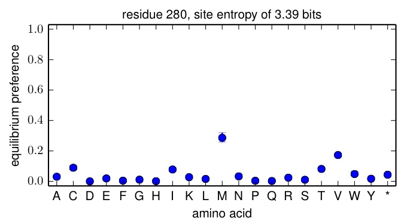
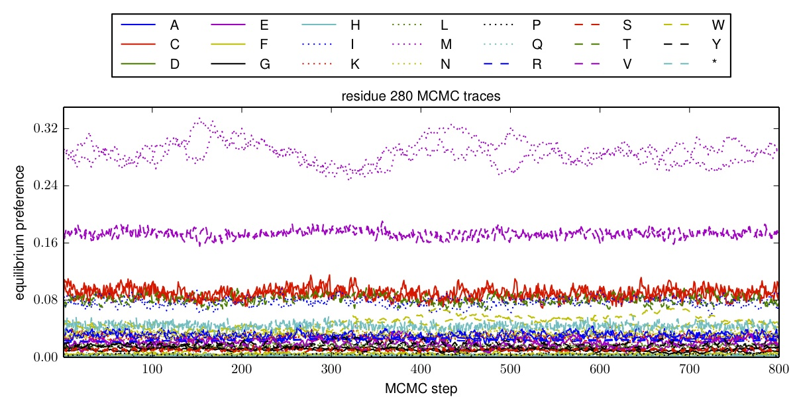

.. _mapmuts_inferpreferences.py:

======================================
mapmuts_inferpreferences.py
======================================

This script infers the equilibrium preferences of each site for each amino acid. It does this using a Bayesian approach implemented via MCMC (Markov chain Monte Carlo).

Because this script uses MCMC, it takes a fairly long time to run -- perhaps as long as several days depending on your computer and the specific data set.

This script takes as input the *codoncounts.txt* files created by :ref:`mapmuts_parsecounts.py`, and so is designed to be run after you have completed the analysis with that script.

Dependencies
--------------
This script requires `pymc`_ for the Bayesian inference, which in turn requires `numpy`_. If you want the script to make plots, you also need `matplotlib`_. You should use `pymc`_ version 2.3. This script may **not** work if you are using another version of `pymc`_ (so check that as a possible problem if you are getting strange error messages).

Background and nomenclature
------------------------------
This script is designed for the analysis of plasmid mutant libraries and viruses grown from those libraries. Mutations in the plasmid mutant library will be subject to selection upon viral growth: favorable mutations will increase in frequency, and deleterious mutations will decrease in frequency. The equilibrium preferences inferred by this script represent the expected frequency of each amino acid at each site in a hypothetical experiment where all amino acids are initially introduced at equal frequency. For the purposes of this script, we also consider stop codons (denoted by * character) to be a possible amino acid, so there are really 21 possible identities at each site.

The equilibrium frequency of amino acid *a* at site *r* is represented by :math:`\pi_{r,a}`. If all amino acids are equally likely at a site, then we would expect :math:`\pi_{r,a} = 1 / 20 = 0.05` for the 20 amino acids and :math:`\pi_{r,a} = 0` for stop codons. If there is complete selection for a specific amino acid at a site, then we expect :math:`\pi_{r,a} = 1` for the favored amino acid and :math:`\pi_{r,a} = 0` for all other amino acids. When :math:`\pi_{r,a}` for a stop codon is greater than zero, that either indicates that there is selection to prematurely truncate the protein (unlikely in most cases), or simply provides an indication of the accuracy of the experiment / inference.

Note that it is in principle possible to infer a preference for each of the 64 codon identities. By instead inferring preferences only for amino acids, we are essentially assuming that all selection operates on amino acids, and synonymous codons are equivalent.

We consider an experiment that contains the following four samples:

    * *DNA* : This sample is simply unmutated wildtype DNA. It measures the sequencing error rate.

    * *RNA* : This sample is reverse-transcribed RNA transcribed from unmutated wildtype DNA. It measures sequencing errors plus reverse-transcription errors.

    * *mutDNA* : This sample is plasmid mutant library DNA. It measures the underlying mutagenesis rate in the mutant library plus sequencing errors.

    * *mutvirus* : This sample is the virus mutant pool grown from the plasmid mutant library. It measures the selection on the mutations in the *mutDNA* library plus reverse-transcription and sequencing errors.

If there were no sequencing or reverse transcription errors, then :math:`\pi_{r,a}` would be proportional to the number of times a mutation occurred in the *mutvirus* sample divided by the number of times that it occurred in the *mutDNA* sample, although there would of course be sampling errors that would bias the estimate for finite libraries. This script accounts for sources of error, and estimates the posterior distribution of :math:`\pi_{r,a}` given the sequencing data.

Sites are also characterized by their site entropy :math:`h_r = \sum_a \pi_{r,a} \cdot \log_2 \pi_{r,a}`. This site entropy is in bits, since the logarithm is to the base 2.

Inference algorithm
--------------------
A full description of the inference algorithm, definition of likelihood, prior, and posterior functions, etc, can be found in the following PDF file :download:`preference_inference_algorithm.pdf <preference_inference_algorithm.pdf>`

Implementation of the MCMC
----------------------------
The posterior distributions for the preferences are estimated by MCMC using the `pymc`_ package. The script automatically tests for convergence using the *convergence* and *nruns* options. It is suggested that you use *nruns > 1* and *stepincrease > 1* so that you can try to ensure convergence. Substantial effort has been invested to make sure that by default the run will burn-in appropriately and set reasonable step sizes for the variables. The details of this implementation are documented in the source code. 

The log file created by this script will include information about whether the inference for each site converged according the criterium set by *convergence*. If it consistently fails to converge, you might consider increasing *nsteps*.

When examining convergence, the difference between the :math:`\pi_{r,a}` values inferred from different runs is quantified as the `Shannon-Jensen divergence`_. The logarithms are taken to the base 2, so this divergence can range from zero (identical inferred preferences) to one (completely independent inferred preferences).

Running the script
--------------------
To run this script from the prompt, first create a text infile of the
format described below. Then simply run the script with the single text file as the argument, as in::

    mapmuts_inferpreferences.py infile.txt

Input file
--------------
The input file is a text file with a series of *key* / *value* pairs. The required keys are indicated below. The values should not include spaces.

Lines beginning with # and empty lines are ignored.

Keys for the input file:

* *DNA_files* : The input data for this script are the *_codoncounts.txt* files created by :ref:`mapmuts_parsecounts.py`. For each library being used for the inference (and you can combine data from multiple libraries), this key should be followed by a string giving the path to the *_codoncounts.txt* file for the *DNA* sample. The number of files listed here must be the same as the number listed for *RNA_files*, *mutDNA_files*, and *mutvirus_files* as all four files are needed for each library -- they should also be listed in the same order (i.e. library 1, library 2, etc). Only definitively called codons (both reads agree, upper case in the *_codoncounts.txt* file) are used in the counts.

* *RNA_files* : like *DNA_files* but for the *RNA* samples.

* *mutDNA_files* : like *DNA_files* but for the *mutDNA* samples.

* *mutvirus_files* : like *DNA_files* but for the *mutvirus* samples.

* *pi_concentration* : the `concentration parameter`_ of the symmetric `Dirichlet distribution`_  used as the prior over the :math:`\pi_{r,a}` values. This is the parameter denoted as :math:`\sigma_{\pi}` in the full writeup in the `Inference algorithm`_ section. Note that the concentration parameter here is taken to represent the value of each of the individual elements in the parameter vector. Choosing a value of *pi_concentration = 1* corresponds to a uniform prior over all of the possible vectors of *pi_concentration* values, and is probably what you want to choose unless you have a good reason to do otherwise. A value of *pi_concentration > 1* favors vectors where all *pi_concentration* values aer similar, and a value of *pi_concentration < 1* favors vectors where some :math:`\pi_{r,a}` values are large and others are small.

* *epsilon_concentration* : the `concentration parameter`_ of the (non-symmetric) `Dirichlet distribution`_ used as a prior over the error rate observed in the *DNA* library. This is the parameter denoted as :math:`\sigma_{\epsilon}` in the full writeup in the `Inference algorithm`_ section. The suggested value is one.

* *mu_concentration* : the `concentration parameter`_ of the (non-symmetric) `Dirichlet distribution`_ used as a prior over the mutagenesis rate observed in the *mutDNA* library. This is the parameter denoted as :math:`\sigma_{\mu}` in the full writeup in the `Inference algorithm`_ section. The suggested value is one.

* *rho_concentration* : the `concentration parameter`_ of the (non-symmetric) `Dirichlet distribution`_ used as a prior over the reverse-transcription error rate in the *RNA* library. This is the parameter denoted as :math:`\sigma_{\rho}` in the full writeup in the `Inference algorithm`_ section. The suggested value is one.

* *minvalue* : a number specifying the minimum value for the prior estimates mutation and error rates determined from the overall library means. Having such a minimum value keeps any of the prior estimates from being set to zero or negative values. A reasonable value is *1e-7*.

* *seed* : integer seed for the random number generator. Runs with the same seed should generate exactly the same output. Otherwise the output may differ for different seeds as the MCMC uses random numbers.

* *nruns* : the number of independent MCMC runs. Must be at least one, but it is recommended that you use *nruns* equal to at least 2 (and probably preferably 3), as this allows checks for MCMC convergence. When multiple runs are performed, the reported equilibrium preferences come from all runs.

* *nsteps* : the number of steps for each MCMC run. A reasonable starting value is probably 200000. Note that the number of burn-in steps are not explicitly specified in this input file, but the program implements internal methods that should ensure adequate burn-in that is not included in the output. You will have to look at the source code if you want to understand that in detail. 

* *thin* : the posterior is only recorded every *thin* steps. If you want to record every value, then set *thin* to one. However, consecutive steps are usually correlated, so it is often preferable to set *thin* to a number greater than one. A suggested value is 200. *nsteps* must be a multiple of *thin*.

* *convergence* : the test applied to the MCMC runs to see if they converged. This option is only meaningful if *nruns* > 1 (as is recommended). For each pair of MCMC runs, we calculate the `Shannon-Jensen divergence`_ (logarithm base 2) between the :math:`\pi_{r,a}` values for all *a* for that value of *r*. If the runs converge to identical values, this difference will be zero, whereas its maximum value for highly diverged runs is one. We test whether the actual divergence is less than the value specified by *convergence*. If the difference is greater than *convergence*, then what is done next depends on the values of *stepincrease*. A recommended value for *convergence* is 0.01. The log file contains information about whether the inference converged for each site.

* *stepincrease* : If the chain fails to converge for a given inference (according to the criterion of *convergence*), then the default action is to try to increase the number of steps to be equal to *stepincrease * nsteps*. We then test again for convergence for these longer MCMC runs. Typically increasing the step number might improve convergence. So *stepincrease* must be a number >= 1. If it is one, that is equivalent to not doing any *stepincrease*. If *stepincrease* is greater than one, we then try running the MCMC for *stepincrease * nsteps* steps for each run. If the chain still does not converge, nothing further is done, but we do use the inferences from the longer chain. A suggested value of *stepincrease* is 4.

* *MCMC_traces* is the directory to which we write plots showing the traces of the equilibrium preferences :math:`\pi_{r,a}` as a function of the number of MCMC steps after burn-in and thinning. If you set this to the string *None*, then no such plots are created. Otherwise, if `matplotlib`_ is available, then files with the prefix specified by *outfileprefix* and the suffix corresponding to the residue (such as *residue_1.pdf* or *residue_334.pdf*) are created in the directory *MCMC_traces*. Note that this directory must already exist; it is NOT created.

* *preference_plots* is the directory to which we write plots showing the equilibrium preferences for all amino acids at a site. Shown are the posterior mean and the median-centered 95% credible interval of the posterior. If you set this to the string *None*, then no such plots are created. Otherwise, if `matplotlib`_ is available, then files with the prefix specified by *outfileprefix* and the suffix corresponding to the residue (such as *residue_1.pdf* or *residue_334.pdf*) are created in the directory *preference_plots*. Note that this directory must already exist; it is NOT created.

* *outfileprefix* is a string giving the prefix for the output files described below.

* *ncpus* is an option that allows you to run the analyses using multiple CPUs. This will usually be helpful, because these runs can take a long time. If you set *ncpus* to 1, then we just use one CPU. But if you are working on a multi-threaded processor, then setting to a larger number will take advantage of the additional CPUs. Note however that if you set *ncpus* to a number larger than the number of spare CPUs, you will overload the processor -- so if you only have one CPU, set this to just 1.

* *sites* is an optional key. If specified, it should have a key of *sites* and is used to specify that we only examine certain sites. If this line is not included or is set to *all* then all sites listed in the count files (those specified by *DNA_file*, *mutDNA_files*, etc) are used in tallying the counts. However, sometimes you may only want to specify a certain range of sites. If so, *sites* allows you to do this. Just put the number of the first and last site that you want to include, and all sites in this range will be counted. For example, a line of::

    sites 2 565

  means that we would only infer preferences for residues 2, 3, ..., 564, 565. In this case, we would exclude residue one from the range. You might want to do this if for example you did not mutagenize the N-terminal methionine of your gene.

* *removeoutlier* is an option that can only be used if there are 3 or more libraries specified by *DNA_files*, *RNA_files*, *mutDNA_files*, and *mutvirus_files*. If there are three or more libraries, this option specifies that for each site, we attempt to identify the one library that is an outlier at this site in terms of the inferred :math:`\pi_{r,a}` values. This single outlier library is then excluded from the final inference of the :math:`\pi_{r,a}` values. The rationale for using this option is that occasionally one library appears to give much different :math:`\pi_{r,a}` values (usually a much larger value for some specific value of *a*) than the other libraries -- this is probably due to linkage of that mutation with another beneficial mutation. Therefore, identifying the one outlier and removing it from the analysis could be helpful. The concern of course is that this needs to be done in some unbiased way rather than just cherry-picking libraries for removal at specific sites. This option does that -- a single outlier library is removed for all sites according to the following well-defined algorithm is applied to the inference of the :math:`\pi_{r,a}` values for each site *r*:

    1) For each of the libraries specified (by *DNA_file*, *RNA_files*, etc), the :math:`\pi_{r,a}` values are inferred just using the data from that individual library.

    2) For each of the libraries, we compute the **average** pairwise `Shannon-Jensen divergence`_ (logarithms base 2) between the :math:`\pi_{r,a}` values for that library and all of the other libraries. We identify the library with the highest average pairwise divergence to the other libraries as the outlier at this site.

    3) We then infer the :math:`\pi_{r,a}` values using the data from all of the libraries **except** the one identified as the outlier. This set of :math:`\pi_{r,a}` value is what is reported as the amino-acid preferences for site *r*.

  If you want to do this type of removal of outliers, then set *removeoutlier* to *True*. Otherwise set it to *False*. Note that an error will be raised if *removeoutlier* is *True* but fewer than 3 libraries are specified.

Example input file
---------------------
Here is an example input file::

    # Input file for mapmuts_inferpreferences.py
    DNA_files DNA/WT-1_DNA_codoncounts.txt
    RNA_files RNA/WT-1_RNA_codoncounts.txt
    mutDNA_files mutDNA/WT-1_mutDNA_codoncounts.txt
    mutvirus_files mutvirus-p1/WT-1_mutvirus-p1_codoncounts.txt
    epsilon_concentration 1.0
    mu_concentration 1.0
    rho_concentration 1.0
    pi_concentration 1.0
    minvalue 1e-7
    seed 1
    nruns 3
    nsteps 200000
    thin 200
    stepincrease 4
    convergence 0.01
    MCMC_traces None
    preference_plots preference_plots/
    outfileprefix WT-1
    ncpus 2
    sites all
    removeoutlier False

Output
--------
Output files are created with the prefix specified by *outfileprefix* followed by an underscore and then the following suffix. If any of these files already exist, they are overwritten. These files are:

* *inferpreferences_log.txt* : a text file logging the progress of this script. The convergence reported in this file when *nruns > 1* is the absolute value of the difference between the :math:`\pi_{r,a}` values between the two runs; a value of zero indicates perfect convergence between the two runs.

* *equilibriumpreferences.txt* : a text file giving the MCMC-inferred equilibrium preference :math:`\pi_{r,a}` for each amino acid *a* at each site *r*. Stop codons (denoted by the * character) are included as possible identities. The file also gives the site entropy :math:`h_r = \sum_a \pi_{r,a} \log_2 \pi_{r,a}` in bits for each site. 

  The first line is a title line that begins with a # character and then lists the column headers separated by tabs. The remaining lines contain the data.

  The columns contain tab-separated values as follows:

    * The first column gives the residue number in 1, 2, ... numbering. The header for this column is *SITE*.
    
    * The second column gives the wildtype amino acid at the site (such as *N* or *R*). If there are multiple libraries specified (such as multiple file listed under *DNA_files*, *mutDNA_files*, etc), then instead this column lists comma-separated (but no spaces) identities for each of the libraries in order, such as *N,N,H,H* if there are four libraries two of which have *N* and two of which have *H*. The header for this column is *WT_AA*.
    
    * The third column lists the site entropy :math:`h_r`. The header for this column is *SITE_ENTROPY*.
    
    * The remaining 21 columns list the equilibrium preference :math:`\pi_{r,a}` values for each amino acid *a* at this site *r*. The amino acids are listed in alphabetical order according to their one letter codes, and then the final column gives the equilibrium preference for a stop codon (denoted by a * character). The headers for these columns are *PI_A*, *PI_C*, *PI_D*, ..., *PI_W*, *PI_Y*, *PI_**. Here is an example of a few lines::

        #SITE   WT_AA   SITE_ENTROPY    PI_A    PI_C    PI_D    PI_E    PI_F    PI_G    PI_H    PI_I    PI_K    PI_L    PI_M    PI_N    PI_P    PI_Q    PI_R    PI_S    PI_T    PI_V    PI_W    PI_Y    PI_*
        1   M   0.885694    0.000680047 0.00185968  8.48048e-06 0.00128217  0.0289946   0.000654589 0.0212144   0.0205306   0.0021597   0.00056726  0.876551    0.00130602  0.000789781 0.00144568  0.000414457 0.00071164  0.00126055  0.00167084  0.0352283   0.00176486  0.000905383
        2   A   1.1671  0.709575    0.00177747  3.79503e-05 0.00298854  0.00390524  0.00131246  0.00379599  0.000913006 0.00121497  0.000535209 0.00276335  0.00140061  0.000694694 0.0032134   0.00464972  0.000463924 0.000908368 0.254241    0.00335749  0.00137437  0.000876985
        3   N   3.2593  0.129992    0.000540239 4.2514e-06  0.00171887  0.0212062   0.0006086   0.102743    0.0431489   0.00524637  0.0771062   0.021714    0.0641921   0.00338082  0.0149898   0.0106522   0.13886 0.0247841   0.00607319  0.0500692   0.282389    0.000581555

* *equilibriumpreferences_credibleintervals_95.txt* : a text file giving the median-centered 95% credible intervals on the :math:`\pi_{r,a}` values in *equilibriumpreferences.txt*. The first column is *SITE* and the remaining columns give the upper and lower bounds on the credible intervals for each of the :math:`\pi_{r,a}` values as comma-separated numbers (no spaces) in the same order that they are listed in *equilibriumpreferencesfile.txt*. Here is an example::

        #SITE   PI_A_95cred PI_C_95cred PI_D_95cred PI_E_95cred PI_F_95cred PI_G_95cred PI_H_95cred PI_I_95cred PI_K_95cred PI_L_95cred PI_M_95cred PI_N_95cred PI_P_95cred PI_Q_95cred PI_R_95cred PI_S_95cred PI_T_95cred PI_V_95cred PI_W_95cred PI_Y_95cred PI_*_95cred
        1   1.49582e-05,0.00269598  7.2227e-05,0.00604361   4.37378e-06,1.17951e-05 3.26837e-05,0.00433571  0.0114465,0.0491834 1.82621e-05,0.00208322  0.00989126,0.0318659    0.00135281,0.0554989    4.87099e-05,0.00754094  1.41237e-05,0.00202465  0.821886,0.925528   3.69704e-05,0.00458556  1.94864e-05,0.0027967   3.89356e-05,0.00557027  8.44362e-06,0.00134572  1.76935e-05,0.0025792   3.51256e-05,0.00460279  3.68112e-05,0.00664131  0.0270458,0.0403275 5.19957e-05,0.00543017  2.3493e-05,0.00336828
        2   0.683813,0.729505   5.48957e-05,0.00581796  3.3971e-05,4.26404e-05  6.74445e-05,0.0109755   4.8097e-05,0.0145215    5.40342e-05,0.00379731  0.000377183,0.00853322  2.13206e-05,0.00337318  3.52239e-05,0.00407263  1.62767e-05,0.00193362  7.56385e-05,0.00950661  4.20842e-05,0.00481382  1.91134e-05,0.00253192  0.000126937,0.0090789   0.0036588,0.00587762    1.0427e-05,0.0016747    2.57371e-05,0.00350532  0.231977,0.267635   9.01372e-05,0.0116063   3.61905e-05,0.00479547  2.30435e-05,0.0032731
        3   0.122949,0.137744   1.51152e-05,0.00177613  1.65846e-07,1.00925e-05 0.000558957,0.0032513   0.015292,0.0269782  4.06388e-05,0.00157236  0.0925438,0.111993  0.0384322,0.0481046 0.00322823,0.00788021   0.0722691,0.0822557 0.0159843,0.0271257 0.0569958,0.0722337 0.000939467,0.00723918  0.0115211,0.0187761 0.00937067,0.0117235    0.135176,0.142903   0.0211448,0.0287984 0.00433432,0.00801638   0.0457743,0.0548462 0.2689,0.29917  2.91378e-05,0.00163938

* Plots showing the equilibrium preferences for each amino acid at a site. These plots are are PDFs in the directory specified by *preference_plots*. The plots have the prefix given by *outfileprefix* followed by an underscore and the residue number, such as *_residue_1.pdf*. The points show the mean estimate, and the error bars show the median-centered 95% credible interval. Here is an example of such a plot:

   Example *preference_plots* plot.

* Plots showing the traces of the equilibrium preferences during the MCMC, in the directory specified by *MCMC_traces* (if this option is being used). These plots are PDFs with the prefix given by *outfileprefix* followed by an underscore and the residue number, such as *_residue_1.pdf*. Here is an example of such a plot:

   Example *MCMC_traces* plot.

.. include:: weblinks.txt
