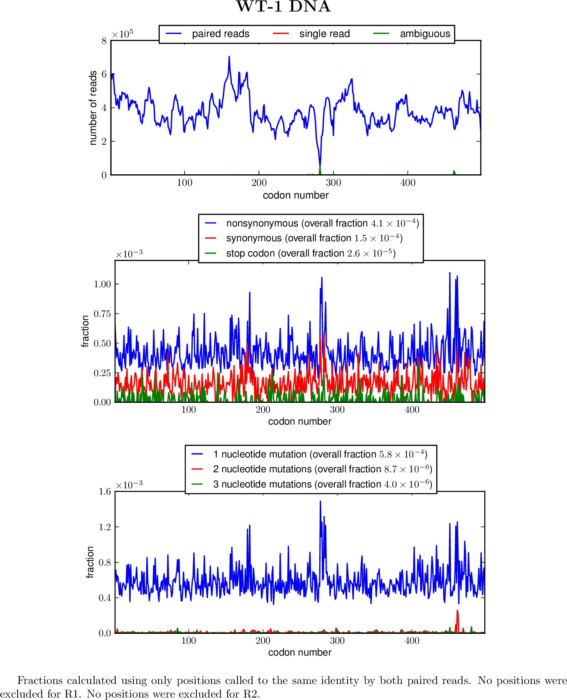

.. _mapmuts_parsecounts.py:

===========================================
mapmuts_parsecounts.py
===========================================

Parses counts from alignments in the ``*_alignments.txt.gz`` file built by :ref:`mapmuts_makealignments.py` into
two text output files giving the counts of different nucleotide and codon identities.

To run this script from the prompt, first create a text infile of the
format described below. Then simply type :ref:`mapmuts_parsecounts.py`
followed by the infile name. For example, if the name is ``infile.txt``,
type::

    mapmuts_parsecounts.py infile.txt

The overlapping paired-end read alignments are used to call nucleotide
identities. Nucleotides are called as follows:

* If both reads agree on the identity and neither relevant read position
  is in the exclusion lists specified in the input file (`r1exclude` or `r2exclude`), then the
  nucleotide is called at that identity using upper-case nucleotides,
  for example 'A' or 'T'.

* If one read specifies an identity and the other read gives an 'N'
  or is at an excluded position, the identity is called to the 
  lower-case value of the read the specifies an identity. For
  example, a position might be called to 'a' or 't'.

* If the two reads specify different identities, or if both specify
  an N or have the position excluded, a position is called to 'N'

Codons are called to the constituent nucleotides using the 
aforementioned scheme. Codons for which only partial nucleotide
coverage is achieved are not called.

If `pylab`_ / `matplotlib`_ are available, summary plots are also
generated. If `pdflatex`_ is available, these plots are merged
into a summary PDF document as well.

Input file format
--------------------
The input file specifies `key` / `value` pairs on individual lines in the format::

    key1 value1
    key2 value2

Blank lines or lines
that begin with # are ignored (i.e. as comment lines). The input file
should contain the following keys:

* `alignmentfile` specifies the name of a ``*_alignments.txt.gz`` file
  built by running :ref:`mapmuts_makealignments.py`.

* `fullgenefile` specifies the name of the file containing the full target
  amplicon to which the reads were aligned. This should be a FASTA file
  containing a single sequence. This should be the same sequence used when
  running :ref:`mapmuts_makealignments.py` to make `alignmentfile`.
  
* `generange` specifies region of the amplicon that contains the
  the coding sequence. This should be two number specifying the
  first and last nucleotide of the sequence in `fullgenefile` that
  are part of the coding sequence in 1, 2, ... numbering. This should
  be the same value of `generange` used when running :ref:`mapmuts_makealignments.py`. 
  to make `alignmentfile`.
  The gene must be a valid coding sequence that can be translated; the terminal
  stop codon should not be included.

* `upcase` specifies how we handle possible upper / lower case differences
  in nucleotide codes. This is crucial because of the case-dependent coding
  of nucleotide identities (with upper-case indicating definitively called
  by both reads, and lower case indicating called by just one read). If `upcase`
  is `True`, then all sequences are converted to upper case before alignment.
  This is the safest option, but is also the slowest since it requires
  so many case conversions. If `upcase` is test, then the gene sequence is
  converted to upper case, and the alignment file is tested to make sure 
  the first entry is upper case. If the first entry is upper case,
  no case conversion is done on the alignments, which will be
  faster. If the first entry is not upper case, then an exception
  is raised, and you wil probably have to switch this option to `True`.

* `r1exclude` specifies read position in the R1 read that are excluded
  from the analysis. You might want to exclude a position of the results
  of :ref:`mapmuts_makealignments.py` make clear that certain read positions have
  very high error rates (numbers of mismatches) relative to other positions.
  If no positions are being excluded, enter `None`. If positions are being
  excluded, list the numbers separated by spaces of the positions to exclude
  in 1, 2, ... numbering.

* `r2exclude` is like `r1exclude`, but for the R2 read.

* `outfileprefix` specifies the prefix appended to all file names created
  by this method. The specific files and their suffixes are described in the
  section on the output files below. Any existing output files are overwritten.

* `samplename` specifies the name of the sample for this run of the
  script. Name are allowed to contain spaces.

Here is an example input file::

    # Example input file to mapmuts_parsecounts.py
    alignmentfile sample_1_alignments.txt.gz
    fullgenefile Aichi68-NP_amplicon.fasta
    generange 62 1555
    upcase test
    r1exclude None
    r2exclude 2 3 48 49
    outfileprefix example_run
    samplename example run

Output files
----------------
Running this script produces a series of output files. The names of these files
consist of the prefix specified by `outfileprefix` in the input file, then the
indicated suffix. Any existing files are overwritten. The output files:

* `outfileprefix`\_parsecounts_log.txt : a text file that tracks the output of this script.

* `outfileprefix`\_ntcounts.txt : A file listing the number of occurrences of each nucleotide
  at each position. Has the following columns:

    * POSITION : the nucleotide position in 1, 2, ... numbering.

    * WT : wildtype nucleotide identity, upper case

    * COUNTS : total number of times this position is covered by an
      an aligned read pair in `alignmentfile`.

    * all nucleotide codes (A, T, C, G, a, t, c, g, N) : number of times
      the reads call the nucleotide to each of these identities. A,
      T, C, and G represent nucleotides called to the same identity
      by both reads. a, t, c, and g represent nucleotides called by
      one read, with the other ambiguous or in the `r1exclude` or
      `r2exclude` list for that read position. N represents nucleotides
      called to conflicting values by both reads, or ambiguous or
      excluded in both reads.

* `outfileprefix`\_codoncounts.txt : A file like `outfileprefix`\_ntcounts.txt 
  but for codon positions.
  Codons are called to identities of their substituent nucleotides.
  If some of the nucleotides in a codon are not called, no identity
  is called for the codon.

* `outfileprefix`\_aacounts.txt : A file giving the number of occurrences of each amino
  acid among the definitively called codon (both reads agree, indicated by
  upper case codon in `outfileprefix`\_codoncounts.txt) for each position.

* `outfileprefix`\_codondepth.pdf : Created if `pylab`_ / `matplotlib`_ is available, a graphical
  summary of read depth at each codon position.

* `outfileprefix`\_syn-ns-dist.pdf : Created if `pylab`_ / `matplotlib`_ is available, a graphical
  summary of distribution of synonymous and nonsynonymous
  mutations among all definitively called (by both reads)
  mutations.

* `outfileprefix`\_nmutspercodon-dist.pdf : Created if `pylab`_ / `matplotlib`_ is available, a graphical summary of the distribution of number of nucleotide mutations per codon mutations among all definitively called (by both reads) codons.

* `outfileprefix`\_parsesummary.pdf : Created if `pylab`_ / `matplotlib`_ and `pdflatex`_ are available, an
  overall graphical summary of the results of the alignment parsing.

Example summary plot
----------------------
Here is an example of the summary created as `outfileprefix`\_parsesummary.pdf.

.. include:: weblinks.txt
