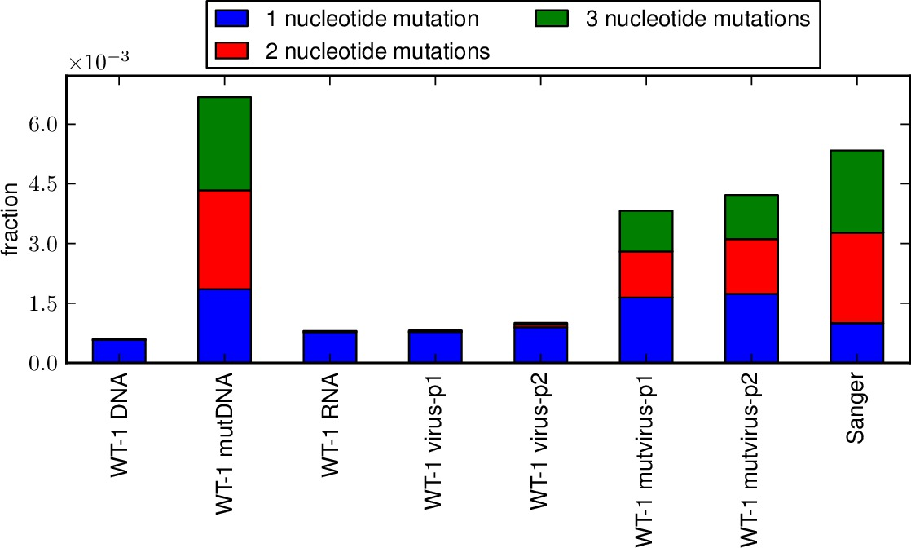
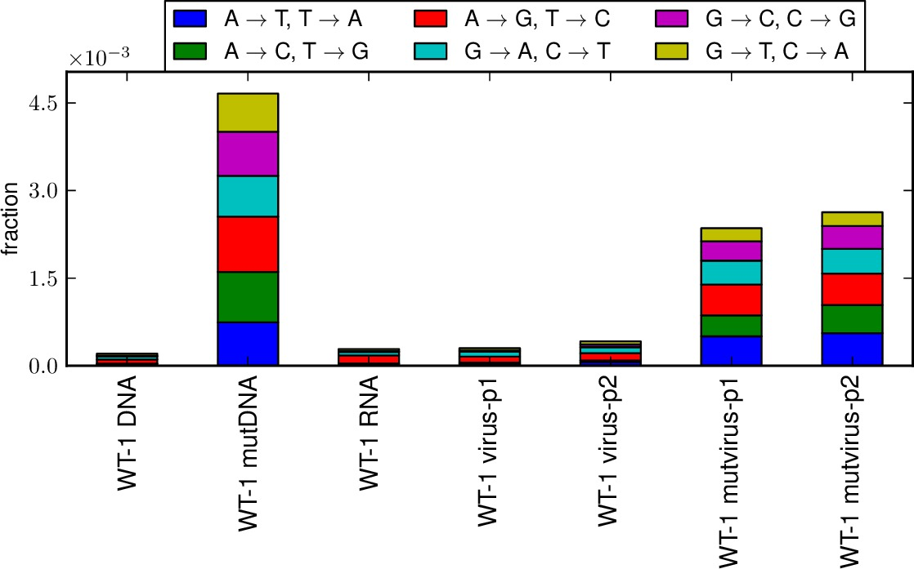

.. _mapmuts_parsesummaryplots.py:

=======================================
mapmuts_parsesummaryplots.py
=======================================

Makes summary plots after several runs of :ref:`mapmuts_parsecounts.py`.

This script creates stacked bar graphs giving the fraction of all sites that
have specific nucleotide mutation types (i.e. A->T, etc) and specific
codon mutation types (i.e. nonsynonymous, synonymous, stop codon; or one versus two versus three nucleotide mutations per mutant codon) for
several samples that have been analyzed by :ref:`mapmuts_parsecounts.py`. This allows you to compare the mutation frequencies and
distributions among samples.

To run this script from the prompt, first create a text infile of the
format described below. Then simply type :ref:`mapmuts_parsesummaryplots.py`
followed by the infile name. For example, if the name is ``infile.txt``,
type::

    mapmuts_parsesummaryplots.py infile.txt

This script will only work if `pylab`_ / `matplotlib`_ are available.

Input file format
-------------------
This script is designed to be run after you have already run 
:ref:`mapmuts_parsecounts.py` on several samples. Each run of that program
generates a ``*_codoncounts.txt`` and a ``*_ntcounts.txt`` file. This script reads
those files and creates a stacked bar graph that summarizes the output
for the several samples.

The input file should have the following format:

    * It should first have two or more lines listing the samples that are being analyzed. Each of these lines should begin with the prefix for the ``*_codoncounts.txt`` and the ``*_ntcounts.txt`` files for a sample, as generated by :ref:`mapmuts_parsecounts.py`. For example, if these files have the paths ``dir1/sample1_codoncounts.txt`` and ``dir1/sample1_ntcounts.txt`` then the first entry on the line should be *dir1/sample1*. Note that this prefix cannot contain any spaces. It should then be followed by the name assigned to that sample in the plot -- this name can contain spaces.

    * You can then add as many instances as you want of the keys *manual_ntfracs* or *manual_codontypes*, *manual_codonnmuts*. These are optional, so you do not have to specify any lines with this key. These keys allow you to specify the plotting of additional manually specified bars -- typically you might want to do this if you also want to display an analysis by Sanger sequencing. If a line begins with this key, then it should be followed by the following values:

        - *manual_ntfracs* should be followed by a listing of the fraction of mutations of the following types (in order): A->T / T->A, A->C / G->T, A->G / C->T, T->C / G->A, T->G / C-> A, C -> G / G -> C. You should then list the name given to this sample in the plot. For instance::

            manual_ntfracs 0.000042 0.000042 0.000835 0.000793 0.000021 0.000084 Sanger

        - *manual_codontype* should be followed by a listing of the fractions of different types of mutations per codon. The fractions should be (in order): synonymous mutations, nonsynonymous mutations, stop codon. You should then list the name given to this sample in the plot. For instance::

            manual_codontypes 0.001253 0.003945 0.000251 Sanger

        - *manual_codonnmuts* should be followed by a listing of the fractions of the codons with mutations containing (in order) one, two, or three nucleotide mutations. You should then list the name given to this sample in the plot. For instance::

            manual_codonnmuts 0.00431 0.00321 0.00259 Sanger

    * The next line should begin with the key *plotfileprefix*, and the value should specify the prefix given to the plots that are created by this script.

    * The next line should begin with the key *writefracs*, and the value should be either *True* or *False*. If *True* then we write the numerical fractions of mutations in different categories abouve the bars in the plot; if *False* then we don't. These numbers are only written for the plots of ``*_codontypes.pdf`` and ``*_codonnmuts.pdf``.

    * You can then optionally specify an explicit figure width (rather than the standard default) by giving the key *figwidth* followed by the explicit figure width in inches, such as::

        figwidth 8.5

    * You can then optionally specify the key *textwritefracs*. If the value of this key is *False* or *None*, it is equivalent to having not included the key at all. Otherwise, the key should be followed by the prefix of the name of a file that you want to create. File with this prefix followed by ``_codontypes.txt`` and ``_codonnmuts.txt`` are then created that list in tab-separated format the fraction of mutations in the different categories.

    * You can then optionally specify the key *pairedcodonplot*. If this key is not present, or if the value is *False* or *None*, then nothing is done. Otherwise set the value of this key to *True*. If it is *True*, a PDF bar graph with paired bars showing the codon types and number of nucleotide changes per codon mutation is created as detailed in the output file description below. Manual fractions are only shown if both *manual_codontypes* and *manual_codonnmuts* are specified with the same sample name.

Blank lines or lines that begin with # are ignored (i.e. as comment lines).

Here is an example input file::

    # Input file to mapmuts_parsesummaryplots.py
    sample_1 sample 1
    sample_2 sample 2
    manual_ntfracs 0.000042 0.000042 0.000835 0.000793 0.000021 0.000084 Sanger
    manual_codontypes 0.001253 0.003945 0.000251 Sanger
    manual_codonnmuts 0.00431 0.00321 0.00259 Sanger
    plotfileprefix parsesummary
    writefracs True
    textwritefracs False
    pairedcodonplot False

Output files
---------------
This script generates three different PDF bar graph plots. All three plots begin with the prefix *plotfileprefix* and then have the following suffixes and contents:

    * ``*_ntfracs.pdf`` is a plot of the frequencies of the different types of nucleotide mutations (A->T / T->A, A->C / G->T, A->G / C->T, T->C / G->A, T->G / C-> A, C -> G / G -> C).

    * ``*_codontypes.pdf`` is a plot of the frequencies of the different types of codon mutations (synonymous, nonsynonymous, stop codon).

    * ``*_codonnmuts.pdf`` is a plot of the frequences of one, two, and three nucleotide codon mutations. 

    * If *pairedcodonplot* is set to *True*, a plot ``*_codon_types_and_nmuts.pdf`` is created with shows paired bars giving both the codon mutation types and the number of nucleotide changes per codon mutation.

Examples of the first three plots are shown below:

   Example ``*_codonnmuts.pdf`` plot.

.. figure:: parsesummary_codontypes.jpg
   :width: 55%
   :align: center
   :alt: parsesummary_codontypes.jpg

   Example ``*_codontypes.pdf`` plot.

   Example ``*_ntfracs.pdf`` plot.

If the *textwritefracs* option is used, the specified text files containing the fractions will also be created.

.. include:: weblinks.txt
