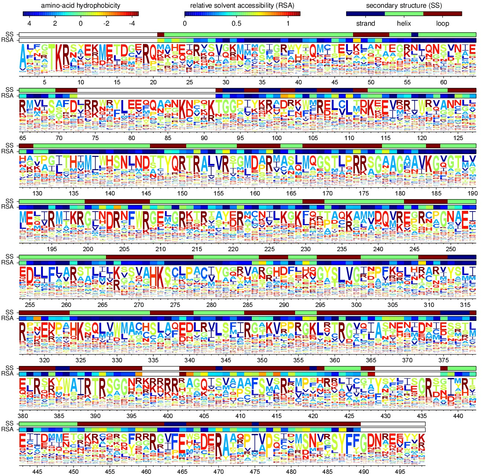

.. _mapmuts_siteprofileplots.py:

=========================================
mapmuts_siteprofileplots.py
=========================================

The primary output of this script is a sequence logo plot showing the preference :math:`\pi_{r,a}` of each protein site *r* for each amino acid *a*. The script can also overlay some information about aspects of protein structure (secondary structure and solvent accessibility).

This script is designed to handle the output in the ``*_equilibriumpreferences.txt`` files created by :ref:`mapmuts_inferpreferences.py`, although it can also be used to analyze the  ``*_equilibriumfreqs.txt`` files produced by :ref:`mapmuts_inferenrichment.py`.

Note that the sequence logo plot produced by this script isn't the standard logo plot in which the stack height is scaled according to the site entropy. Rather, the height of each stack is the same, and the height of amino acid *a* within a stack is proportional to :math:`\pi_{r,a}`. So the heights of the letters given the preference of the site for that amino acid.

Dependencies
---------------
This script requires:

* `matplotlib`_ to make the plots.

* `weblogo`_ to make the sequence logo plots.

* `pyPdf`_ to overlay the secondary structure and solvent accessibility information onto the sequence logos plots.

* Optionally requires `scipy`_ to compute correlations (they will not be computed if `scipy`_ is not available).

Running the script
--------------------
To run this script, simply create an input file with the format described below. If you name your input file ``siteprofileplots_infile.txt``, then run the command::

    mapmuts_siteprofileplots.py siteprofileplots_infile.txt

Input file
--------------
The input file is a text file with a series of *key* / *value* pairs. The required keys are indicated below. The values should not include spaces.

Lines beginning with # and empty lines are ignored.

Keys for the input file:

* *sitepreferences* : The name of the file giving the site preferences :math:`\pi_{r,a}`. Typically this would be the ``*_equilibriumpreferences.txt`` file created by :ref:`mapmuts_inferpreferences.py`, although it could also be the ``*_equilibriumfreqs.txt`` file created by created by :ref:`mapmuts_inferenrichment.py` or :ref:`mapmuts_enrichmentgeomeans.py`. The file has a header, and then for each site *r* there is a line giving the site entropy :math:`h_r` and all of the preferences :math:`\pi_{r,a}`. It is acceptable for a preference for a stop codon (denoted by a * character) to be either present or absent -- but all other 20 amino acids must always be present. The site numbers listed in the file must be consecutive (i.e. there cannot be gaps) within *siterange*. Here is an example of a few lines of such a file::

    #SITE   WT_AA   SITE_ENTROPY    PI_A    PI_C    PI_D    PI_E    PI_F    PI_G    PI_H    PI_I    PI_K    PI_L    PI_M    PI_N    PI_P    PI_Q    PI_R    PI_S    PI_T    PI_V    PI_W    PI_Y    PI_*
    1   M   0.885694    0.000680047 0.00185968  8.48048e-06 0.00128217  0.0289946   0.000654589 0.0212144   0.0205306   0.0021597   0.00056726  0.876551    0.00130602  0.000789781 0.00144568  0.000414457 0.00071164  0.00126055  0.00167084  0.0352283   0.00176486  0.000905383
    2   A   1.1671  0.709575    0.00177747  3.79503e-05 0.00298854  0.00390524  0.00131246  0.00379599  0.000913006 0.00121497  0.000535209 0.00276335  0.00140061  0.000694694 0.0032134   0.00464972  0.000463924 0.000908368 0.254241    0.00335749  0.00137437  0.000876985
    3   N   3.2593  0.129992    0.000540239 4.2514e-06  0.00171887  0.0212062   0.0006086   0.102743    0.0431489   0.00524637  0.0771062   0.021714    0.0641921   0.00338082  0.0149898   0.0106522   0.13886 0.0247841   0.00607319  0.0500692   0.282389    0.000581555

* *outfileprefix* specifies the prefix affixed to each of the output files detailed below. *outfileprefix* can include a directory as part of the prefix (such as ``./plots/replicate-1_``), but if such a directory is included in part of the prefix name then the directory must already exist or an error will be raised -- this script does not create new directories. Any existing files that have the same names specified by *outfileprefix* will be overwritten.

* *siterange* specifies the range of residues that are included in the plot. The value should be two numbers giving the first and the last residues to include in the plots. You would use this option if you want to exclude certain residues (such as the first one in the example above). If you want to include all of the residues, just set to this to be the string *all*. There must be residue numbers in *sitepreferences* for all sites in *siterange*.

* *dsspfile* is an option that allows you to compare the observed site entropies and preferences to the relative solvent accessibility (RSA) and the secondary structure for the sites. This will only be useful if a crystal structure for your protein is available. You can then use the `DSSP`_ webserver to calculate the secondary structures and the RSAs. If you do not want to use this option, just set *dsspfile* to *None*. If you do want to use this option, then run `DSSP`_ on your protein structure -- this script is tested against output from the `DSSP`_ webserver, but should probably work on output from the standalone too. Then save the `DSSP`_ output in a text file, and specify the path to that file as the value for *dsspfile*. This script does not currently have a robust ability to parse the `DSSP`_ output, so you have to do some careful checks. In particular, you must make sure that residue numbers in the PDB file exactly match the residue numbering scheme used for the rest of this analysis (i.e. the same residue numbers found in *sitepreferences*, and that none of the residue numbers contain letter suffixes (such as 24A) as is sometimes the case in PDB files. It is not necessary that all of the residues be present in the PDB. If there are multiple PDB chains, you can specify them using the *dsspchain* option. `DSSP`_ only calculates absolute accessible surface areas (ASAs); the RSAs are computed by normalizing by the maximum ASAs given by `Tien et al, 2013`_.

* *dsspchain* is an option that is only required if *dsspfile* is set to a value other than *None*. In this case, it should specify the chain in the PDB file that we want to use. If there is only one chain, you can set this option to *None*.

* *add_rsa* is an option that can be used if *dsspfile* is being used. This option specifies that the relative solvent accessibilities (RSAs) are shown in a color-coded bar above the sequence logo plot. If you do not want to do this, specify a value of *False*. If you do want to show the RSA bar, then specify a value of *True*. The RSAs are the fractional solvent accessibilities.

* *add_ss* is an option that can be used if *dsspfile* is being used. This option specifies that the sequence logo plot contains a bar showing the secondary structure. If you do not want to do this, specify a value of *False*. If you do want to show the secondary structure bar, then specify a value of *True*. The secondary structures are classified as *helix* (DSSP categories G, H, and I), *strand* (DSSP categories B and E) or *loop* (any other DSSP category).

* *nperline* specifies how many sites are included per line in the sequence logo plot. For example, if you have a protein of length 500 and you set *nperline* to 100, then the sequence logo plot will span 5 lines each showing 100 sites. In general, reasonable values are probably in the range from 50 to 100, but you might adjust based on the size of your protein.

* *includestop* specifies whether we include stop codons as possible amino acid identities if they are specified in *sitepreferences*. If *sitepreferences* comes from ``mapmuts_inferpreferences.py``, then it may contain stop codons (denoted by a * character) as a possible amino acid. If *includestop* is *False*, then these stop codons are **not** considered a possible amino acid in the plots created here, and all of the other preferences are normalized so that the :math:`\pi_{r,a}` values for all 20 non-stop amino acids *a* sum to one. If *includestop* is *True*, then stop codons **are** considered a possible amino acid for the plots created here -- but not that they are assigned a preference of zero if no preference is assigned in *sitepreferences*. In the sequence logo plot, stop codons are indicated with a black *X* character rather than an asterisk. 

  Often, you will not really be interested in stop codons as a potential amino acid at a site because you will assume that they are not viable amino acids as they truncate the protein. This could provide a justification for setting *includestop* to *False*. On the other hand, checking to see that stop codons have very low preferences can be a good sanity check to make sure that the overall analysis is giving reasonable inferences -- in that case, you might set *includestop* to *True* and then check that you don't have lots of black *X* characters in the logo plot.

Example input file
---------------------
Here is an example input file::

    # Input file for mapmuts_siteprofileplots
    sitepreferences combined_equilibriumpreferences.txt 
    outfileprefix WT-1_
    siterange 2 498
    dsspfile ./DSSP_analysis/2IQH_monomerC.dssp
    dsspchain C
    add_rsa True
    add_ss True
    nperline 83
    includestop True

Output
--------
This script will write some brief output to standard out (*sys.stdout*) describing its progress.

It will then generate the following plots, each of which has the indicated suffix preceded by *outfileprefix*:

* ``site_preferences_logoplot.pdf`` : A sequence logo plot showing the preference for each amino acid. The height of each letter is proportional to the preference for that amino acid, :math:`\pi_{r,a}`. The amino-acid letters are colored according to the Kyte-Doolittle hydrophobicity scale. The plot will show site RSAs and SSs in colored bars if *add_rsa* and *add_ss* are *True* -- sites that lack this information in *dsspfile* are white. Here is an example:

* ``site_entropy_plot.pdf`` : A plot of the site entropy as a function of the residue position in the primary sequence.

* ``entropy_rsa_correlationplot.pdf`` : This plot is only produced if the *dsspfile* option is being used. In this case, it is a plot showing the correlation between the site entropy and the RSA (as calculated by `DSSP`_) for all sites for which both pieces of information are available. If `scipy`_ is available, the Pearson correlation coefficient is shown on the plot. 

.. include:: weblinks.txt
